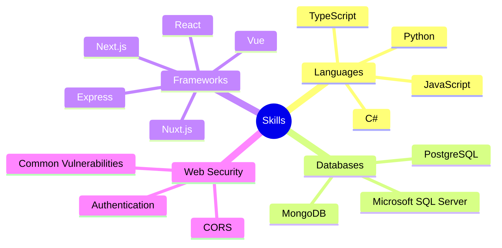

  
  
a full stack developer from Turkey who builds & breaks stuff by day, enjoys movies at night.

```mermaid
mindmap
  root((Skills))
    Languages
      JavaScript
      TypeScript
      C#
      Python
    Databases
      PostgreSQL
      Microsoft SQL Server
      MongoDB
    Frameworks
      React
      Vue
      Next.js
      Nuxt.js
      Express
    Web Security
      Common Vulnerabilities
      Authentication
      CORS
```

<i>Also</i>

  
  
  
  
  
  
  
  

